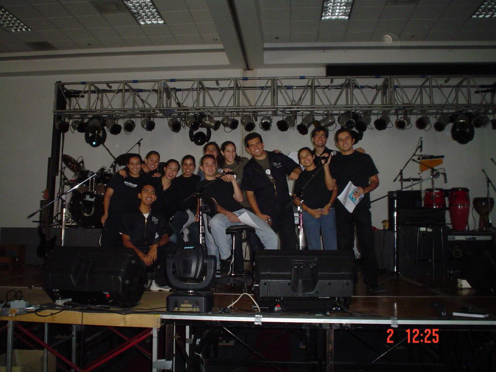
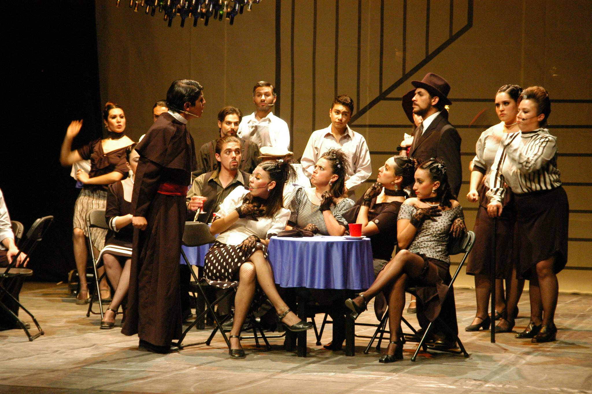
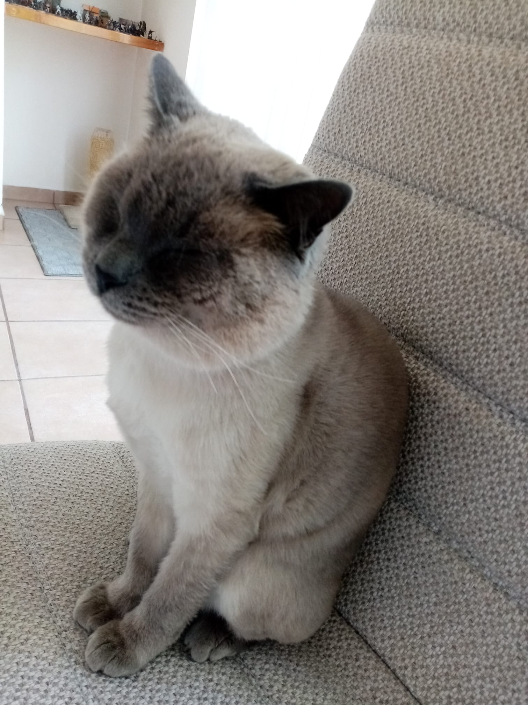
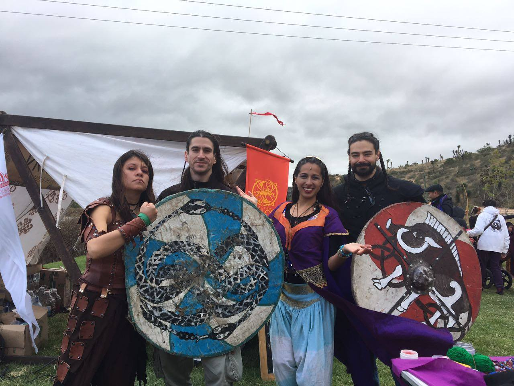
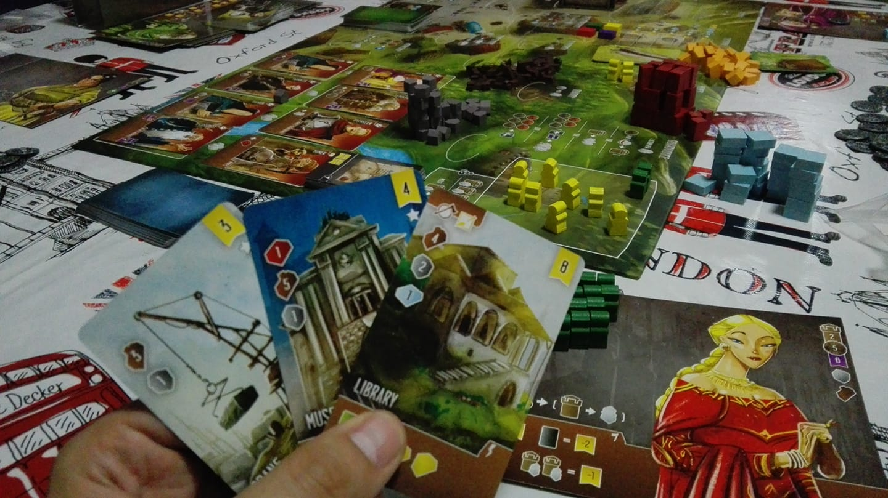
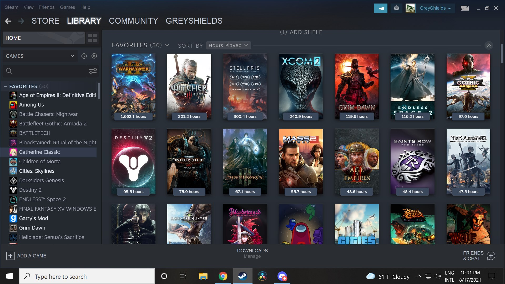
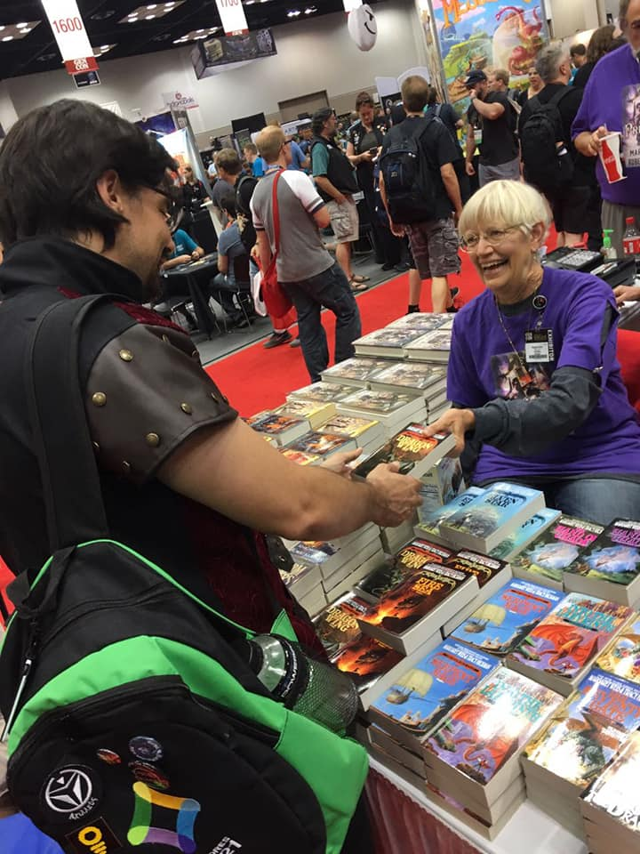

# Benjamín Valdés Aguirre

Actualmente soy profesor docente de tiempo completo en Querétaro en el Tec de Monterrey. Estudié Ingeniero en Sistemas Computacionales (ISC) del Tec de Monterrey Campus Querétaro, al graduarme en 2007 entré a trabajar a un laboratorio de investigación que se enfocaba en el desarrollo de tecnologías para la educación. Ahí trabajé 2 años en modelos computacionales para representar el conocimiento y habilidades haciendo uso de esquemas xmls. A la par, estudié una maestría en Administración de Tecnologías de Información en la Universidad Virtual, y al terminar en 2010, entré a formar parte del programa de becarios CONACYT para estudiar el Doctorado en Ciencias Computacionales en el Tec de Monterrey Campus Estado de México. Durante el doctorado realice un par de estancias en la Universidad de Sussex en Reino Unido para realizar un análisis de la forma en la que agentes tutores inteligentes (Intelligent Tutoring Systems) representan información sobre los estudiantes que interactúan con ellos. Mientras estaba en el doctorado comencé a trabajar como profesor de cátedra y al terminar el doctorado, en 2016, me integré al departamento de computación del campus Querétaro como profesor de tiempo completo.

A lo largo de mi vida académica y profesional he vivido en varios países y ciudades por medio de intercambios o estancias, pero me gusta más vivir en México y en particular Querétaro. De manera resumida he vivido en Ciudad de México (antes D.F.), Estado de México, Boulder Colorado (U.S.A.), Praga (República Checa), Brighton (Inglaterra), Berkeley (U.S.A.), entre otros. 

### Contacto
bvaldesa@tec.mx

## Investigación

### Trabajos publicados: 
lista de publicaciones [Research Gate](https://www.researchgate.net/profile/Benjamin-Valdes-2)

### Intereses:

- Inteligencia Artificial enfocada a la educación.
- Video Juegos Serios.
- Técnicas de transferencia de conocimiento basadas en juegos.

## Formación Académica

- Doctorado en Ciencias Computacionales   ITESM CEM (2016)
- Maestro en Administración de Teconologías de Información ITESM UV (2010)
- Ingeniero en Sistemas Computacionles  ITESM QRO (2007)

## Experiencia Laboral

- Profesor de planta en el departamento de computación del Tecnológico de Monterrey - Campus Querétaro (2016 - Actual)
   * Diseño e Impartición de cursos Tec 20, Tec 21: Bloques, Semanas Tec, Semanas I, Concentración, etc...
- Profesor de cátedra en el departamento de computación del Tecnológico de Monterrey - Campus Querétaro (2010 - 2016)
   * Diseño e Impartición de cursos Tec 20
- Asistente de Investigación grupo DASL4LTD Querétaro (2008 - 2010)
   * Desarrollo de Mapa de Memoria (modelo de representación computacional para conceptos)
- Desarrollador y socio de Scriptorium despacho de desarrollo WEB (2008 - 2010)
   * Desarrollo de sitios comerciales usando Drupal y módulos de PHP
- Prácticante Mars Electronic International (2006 - 2007) 
   * Soporte de T.I. para la infraestructura de redes en la planta.

## Proyectos con Becarios

[Sitio para proyectos de servicio becario](https://benjaminva.github.io/Becarios/)

## Información sobre Cursos 

### Horarios para agendar asesorías

[Google Calender sesiones semanales](https://qrgo.page.link/M6HNX)

### Cursos impartidos

#### Tec 21

- [TC1028 Pensamiento Computacional Para la Ingeniería](https://benjaminva.github.io/TC1028-Pensamiento-Computacional-Ingeneria/)
- [TC1030 Peogramación Orientada a Objetos](https://benjaminva.github.io/TC1030/)
- [TC1033 Pensamiento Computacional Orientado a Objetos](https://benjaminva.github.io/TC1033/index.html)
- [TC1031 Estructuras de Datos](https://benjaminva.github.io/TC1031-calendario/)
- [TC2037 Implementation of Computacional Methods](https://benjaminva.github.io/TC2037-Metodos/)
- TC3006  Concentración Avanzada para la ciencia de datos Bloque 1
   * Machine Learning
   * Software para Ciencia de datos
- TC3007  Concentración Avanzada para la ciencia de datos Bloque 2
   *  Machine Learning
   *  Reto
- TC3002  Desarrollo de aplicaciones avanzadas de ciencias computacionales
   *  Aprendizaje Automático
 
#### Tec 20

  - Tesina 
  - Sistemas Inteligentes
  - Tópico Deep Learning
  - Fundamentos de Programción
  - Estructuras de Datos
  - Lenguajes de Programación
  
## Proyectos Previos

Creador y organizador de Kuxtal concurso para desarrollo de video juego serios para enseñar a niños pequeños habilidades de supervivencias. Este proyecto fue realizado en coolaboración con grupo CADENA (organización de rescatistas y apoyo a zonas de desastres) y el CENAPRED (Centro Nacional Para la Prevención de Desastres).   [Kuxtal](http://kuxtalvideojuegos.weebly.com/)  (2016)

## Actividades Extracurriculares

- Grupo representativo Staff Técnico en micrófonos y piso (2005 - 2007) 
- Grupo representativo Comedia Musical con la obra "La Mujer del Panadero" (2003 - 2004) 

| Staff | Comedia Musical |
| :---------: | :---------: |
|  |  |

## Hobbies

| el gato  | juegos de rol | juegos de mesa | juegos de video | novelas |
| :---------: | :---------: |  :---------: | :---------: |  :---------: |
|  |  |  |  |  |

## FAQ
[Frquentely Asked Questions](benjaminva.github.io/FAQ)
